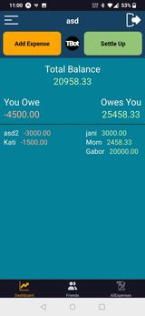
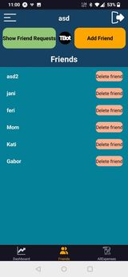

# TheBasisOfTrustRN

## About The Project

The Basis Of Trust is an application that helps the user easily and transparently manage debts between friends, because trust is based on accurate accounting.

BasisOfTrustRN is the part of this existing project written in React Native, so that we can enjoy the benefits of the application on both IOS and Android.

## Build With

## Features

The Login and Register Screens

<table>
  <tr>
    <td></td>
    <td></td>
  </tr>
</table>

The dashboard shows who belongs to the user and to whom the user belongs to. 

Create expense with the Add Expense button

Register a refund with the Settle Up button

<table>
  <tr>
    <td></td>
    <td></td>
    <td></td>
  </tr>
</table>

The user can check the entered expenses on the All Expenses page

On the Friends screen, the user can add new friends based on email or username and manage the requestes

<table>
  <tr>
    <td></td>
    <td></td>
    <td></td>
  </tr>
</table>